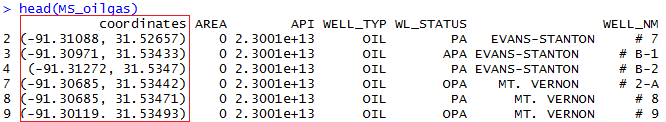
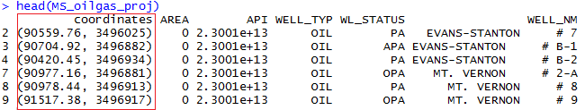

Projection Without Hair-loss
==========================
There are 2 ways that your data can be be referenced:

- Geographically (geographic coordinates; LAT/LONG)
- Locally (projected coordinates; FT/meters/ETC)

If you are trying to make any meaningful analyses on the data, you should project into a projected coordinate system. Projected coordinate systems use linear measurements (feet, meters, etc) between points, rather than angular, geographic lat/long. This allows you to have distances that make sense in semivariograms and kriging.

The most common projected coordinate system is UTM (Universal Transverse Mercator). Because UTM ignores the curvature of the Earth (3d), the planet is divided into &quot;zones&quot; that are planar (2d). You can find the zones [here](https://en.wikipedia.org/wiki/Universal_Transverse_Mercator_coordinate_system#/media/File:Utm-zones.jpg). The NGOM area is 15R/16R/17R. You can find the proj4string for any study area at [www.spatialreference.org](http://www.spatialreference.org). Because most of you are in the NGOM, I have used 16R for the proj4string used below.

Here's a simple workflow to getting things in order:

1. **Is your dataset in lat/long degrees?**  
   Example:  
     
   *Yes*, keep reading.  
   *No*, skip to step 4.  
   
2. **Is your dataset from a ShapeFile?**  
   *Yes*:  
    ```
    library(rgdal)
    data = readOGR("SHAPEFILENAME.shp","SHAPEFILENAME")
    ```  
   *No*:
   ```
   coordinates(data) <- ~lat+long
   ```
3. **Project lat-long to projected coordinate system for NGOM:**  
   ```
   library(sp)  
   spTransform(data, "+proj=utm +zone=16 +ellps=WGS84 +datum=WGS84 +units=m +no\_defs")
   ```
4. Your data should now be in UTM meters!  
   Example:     
   

***
*Created by Tyler Hardy 2016*
